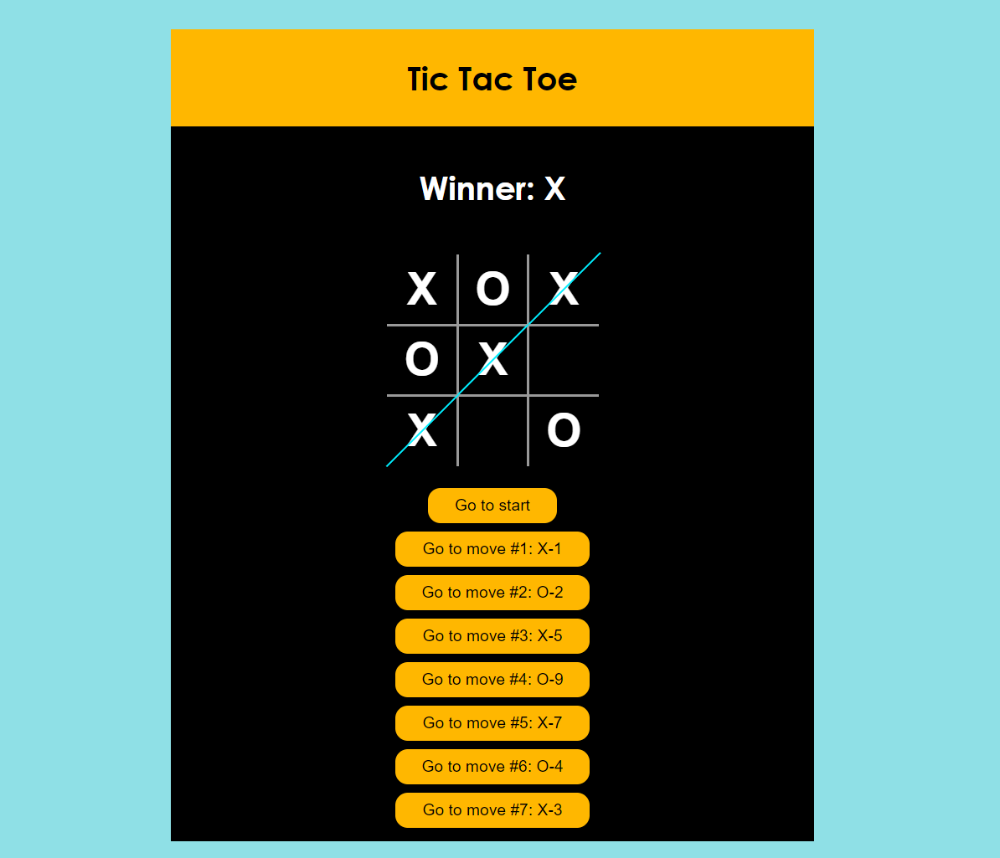

# TicTacToe
<h2>About the project</h2>

<b>TicTacToe</b> in a modern minimalistic design and intuitive interface. A timeless classic where players take turns, strategically thinking through their moves, which are recorded in a rewritable history of moves for later analysis and independent construction of their own tactics

<!-- 👉 Live Demo: <a href='https://tenzies-game.app/'>Tenzies Demo</a> -->

<h3>Build with:</h3>

» React JS  
» Vanilla CSS   

 

<h2>Screenshots of the Project 📸</h2>
 
<h3 align='center'>Game Page 🏆</h3>

